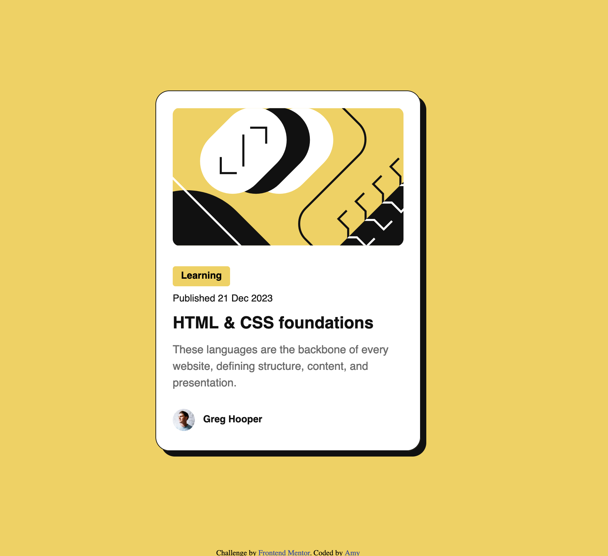

# Frontend Mentor - Blog preview card solution

This is a solution to the [Blog preview card challenge on Frontend Mentor](https://github.com/AmyH-goose/blog-preview-card-main)

## Table of contents

- [Overview](#overview)
  - [The challenge](#the-challenge)
  - [Screenshot](#screenshot)
  - [Links](#links)
- [My process](#my-process)
  - [Built with](#built-with)
  - [What I learned](#what-i-learned)

## Overview
This is Day 2 in my doing frontend masters.

### The challenge

Users should be able to:

- See hover and focus states for all interactive elements on the page

### Screenshot

### Links

- Solution URL: https://github.com/AmyH-goose/blog-preview-card-main 
- Live Site URL: https://tiny-beignet-d9a3ea.netlify.app 

## My process
1. (stared) Analyzed the design file to determine how I was going to organize the elements (how to group elements, what tags to use for each text)
2. edited the html based on analysis
3. in css, I started with a reset of the margins, then I set the custom properties based on the figma design file
4. then i used the classes for each element or element group and tweaked the css so that it looked like the design!

### Built with

- Semantic HTML5 markup
- CSS custom properties
- Flexbox

### What I learned

I learned how to group html elements so that they're more semantic and easier to style in css as a group. I also learned about figma more just by exploring the app while making the code, such as looking at the specific degree of the border, or the spacing between elements. 

### Continued development

I'm still learning about how to make everything more responsive. I think I'm going to do more research on the mobile first approach as well as media queries, and other responsive design concepts. So far, I've swithed the using rem instead of pixels for things like width and font-size, but there's more to be learned. 
